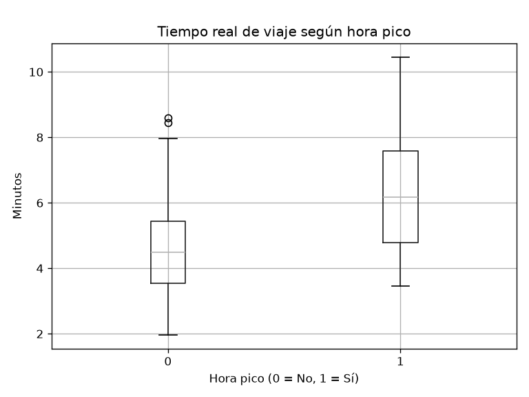
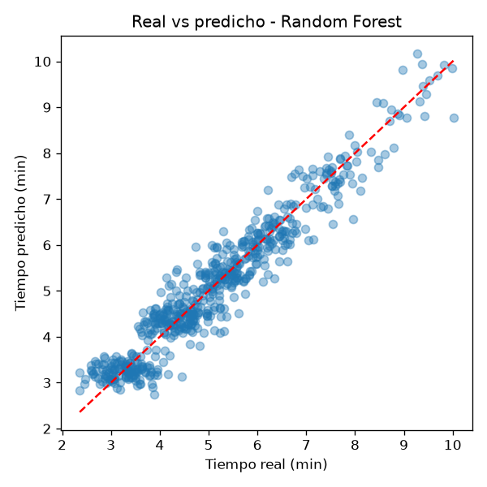

# Sistema Inteligente de Rutas de Transmilenio + Modelo de Aprendizaje Supervisado

**Autor:** Santiago Hernandez - Sebastian Guevara 
**Curso:** Inteligencia Artificial – Octavo semestre
**Universidad:** Universidad Ibero Americana

---

## 1. Descripción del proyecto

Este repositorio contiene dos partes que se complementan:

1. **Sistema basado en reglas (`SistemaInteligente.py`)**: dado un punto A y un punto B de la red de Transmilenio, calcula la mejor ruta y su tiempo total. Usa *hechos* (conexiones entre estaciones con su tiempo en minutos) y *reglas* (conectividad bidireccional, búsqueda de rutas sin repetir estaciones y selección de la ruta de menor tiempo).

2. **Modelo de aprendizaje supervisado (`modelo_transmilenio.py`)**: el sistema de reglas usa tiempos **fijos**, pero en la realidad el tiempo de viaje cambia según la hora, el clima y la cantidad de pasajeros. Este modelo **aprende a partir de datos a predecir el tiempo real de viaje** entre dos estaciones.

### Problema de aprendizaje automático

| Elemento | Descripción |
|---|---|
| Tipo de problema | Regresión (aprendizaje supervisado) |
| Variable a predecir (`y`) | `tiempo_real`: minutos de viaje entre dos estaciones |
| Variables de entrada (`X`) | `origen`, `destino`, `dia`, `hora`, `hora_pico`, `lluvia`, `pasajeros`, `tiempo_base` |
| Modelos comparados | Regresión Lineal y Random Forest |
| Métricas | MAE, RMSE y R² |

---

## 2. Fuentes de datos

### 2.1 Fuentes reales identificadas

Se investigaron fuentes públicas relacionadas con el sistema de transporte masivo de Bogotá:

| Fuente | Entidad | Contenido relevante | Formato |
|---|---|---|---|
| Datos Abiertos Bogotá (datosabiertos.bogota.gov.co) | Alcaldía de Bogotá | Información de movilidad y transporte público de la ciudad | CSV / API |
| Datos abiertos de TransMilenio | TransMilenio S.A. | Validaciones y afluencia de pasajeros por estación, georreferenciación de estaciones y troncales | CSV / API |
| Portal de datos abiertos nacional (datos.gov.co) | Gobierno de Colombia | Conjuntos de datos de transporte y movilidad | CSV / API |
| Observatorio y datos de movilidad | Secretaría Distrital de Movilidad | Velocidades y tiempos de recorrido en corredores | CSV |

**Limitación encontrada:** estas fuentes aportan principalmente afluencia de pasajeros, ubicación de estaciones y velocidades generales, pero **no ofrecen un conjunto de datos público que relacione directamente el tiempo de viaje entre cada par de estaciones con la hora, el clima y el nivel de ocupación**, que es lo que necesita este modelo.

### 2.2 Dataset sintético desarrollado

Por lo anterior, se **generó un dataset simulado** de 3000 viajes (`dataset_transmilenio.csv`) a partir de los tiempos base del sistema de reglas, agregando variabilidad realista.

> **Importante:** los datos son **simulados**, no corresponden a mediciones reales de Transmilenio. Los resultados deben interpretarse como una demostración del método.

**Diccionario de datos**

| Columna | Tipo | Descripción |
|---|---|---|
| `origen` | texto | Estación de origen |
| `destino` | texto | Estación de destino |
| `dia` | texto | Día de la semana |
| `hora` | entero | Hora del día (5 a 22) |
| `hora_pico` | 0 / 1 | 1 si es día laboral entre 6-9 am o 5-7 pm |
| `lluvia` | 0 / 1 | 1 si hubo lluvia (25 % de probabilidad) |
| `pasajeros` | entero | Pasajeros estimados en el tramo (más altos en hora pico) |
| `tiempo_base` | entero | Tiempo fijo del sistema de reglas (minutos) |
| `tiempo_real` | decimal | **Variable objetivo:** tiempo de viaje en minutos |

**Cómo se simula `tiempo_real`:** se parte del tiempo base y se incrementa un 35 % en hora pico, un 10 % con lluvia y una fracción según los pasajeros, más un ruido aleatorio (distribución normal, desviación 0.4 min).

---

## 3. Estructura del repositorio

```
├── SistemaInteligente.py        # Sistema de rutas basado en reglas
├── modelo_transmilenio.py       # Generación de datos, entrenamiento y evaluación
├── dataset_transmilenio.csv     # Dataset sintético (3000 filas)
├── modelo_transmilenio.joblib   # Mejor modelo entrenado
├── grafica_hora_pico.png        # Exploración: tiempo según hora pico
├── grafica_real_vs_predicho.png # Evaluación: real vs predicho
├── requirements.txt             # Dependencias
└── README.md
```

---

## 4. Cómo ejecutarlo

**Requisitos:** Python 3.9 o superior.

```bash
# 1. Clonar el repositorio
git clone [URL_DEL_REPOSITORIO]
cd [NOMBRE_DEL_REPOSITORIO]

# 2. Instalar dependencias
pip install -r requirements.txt

# 3. Ejecutar el modelo de aprendizaje automático
python modelo_transmilenio.py

# 4. (Opcional) Ejecutar el sistema de rutas basado en reglas
python SistemaInteligente.py
```

El script genera el dataset, entrena los modelos, imprime las métricas y guarda las gráficas y el modelo.

---

## 5. Metodología

1. **Generación del dataset** con pandas y numpy (semillas fijas para reproducibilidad).
2. **Exploración:** estadísticas descriptivas, revisión de nulos y gráfica del tiempo según hora pico.
3. **Preprocesamiento:** las variables de texto (`origen`, `destino`, `dia`) se convierten a numéricas con *One-Hot Encoding*.
4. **División de datos:** 80 % entrenamiento (2400 filas) y 20 % prueba (600 filas).
5. **Entrenamiento** de dos modelos dentro de un `Pipeline` de scikit-learn:
   - Regresión Lineal (modelo base)
   - Random Forest con 200 árboles
6. **Evaluación** sobre el conjunto de prueba con MAE, RMSE y R².
7. **Predicción** de un caso nuevo con el mejor modelo.

---

## 6. Resultados

| Modelo | MAE (min) | RMSE (min) | R² |
|---|---|---|---|
| Regresión Lineal | 0.365 | 0.460 | 0.912 |
| **Random Forest** | **0.341** | **0.433** | **0.922** |

- El **Random Forest** obtiene el mejor desempeño: se equivoca en promedio ~0.34 minutos (unos 20 segundos) y explica el 92 % de la variación del tiempo de viaje.
- Ambos modelos tienen resultados cercanos porque la relación simulada es casi lineal.

**Ejemplo de predicción:** Calle 100 → Héroes, lunes 7:00 am, con lluvia y en hora pico:

| Sistema | Tiempo |
|---|---|
| Sistema de reglas (tiempo fijo) | 5 min |
| Modelo de aprendizaje automático | **≈ 8.0 min** |

### Gráficas




---

## 7. Conclusiones y limitaciones

- El modelo captura el efecto de la hora pico, la lluvia y la ocupación sobre el tiempo de viaje, algo que el sistema de reglas con tiempos fijos no puede representar.
- **Limitación principal:** al ser un dataset simulado, el R² es alto porque el modelo descubre la fórmula usada para generar los datos. Con datos reales el desempeño sería menor.
- **Trabajo futuro:**
  - Reemplazar el dataset sintético por datos reales de validaciones y tiempos de recorrido de Transmilenio.
  - Integrar el modelo con `SistemaInteligente.py` para que la mejor ruta se calcule con tiempos predichos según hora y clima.
  - Probar otros algoritmos (Gradient Boosting) y ajustar hiperparámetros.

---

## 8. Tecnologías

Python · pandas · numpy · scikit-learn · matplotlib · joblib
